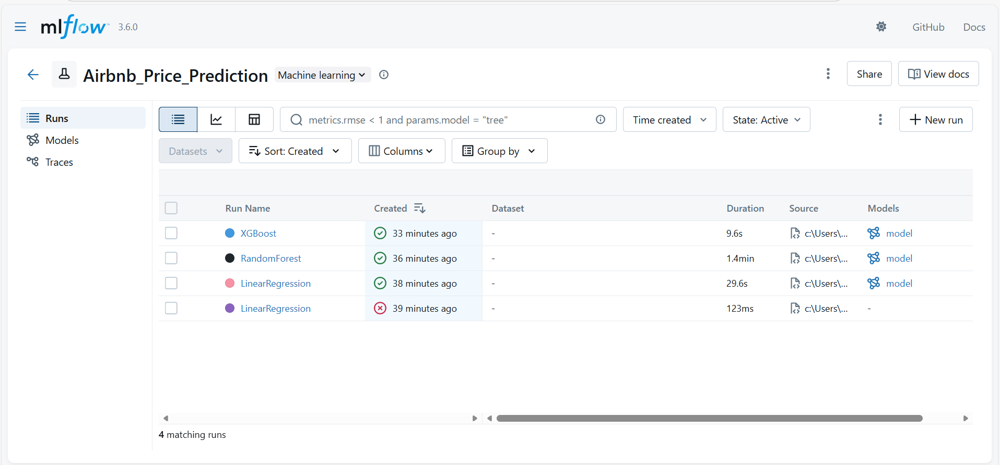
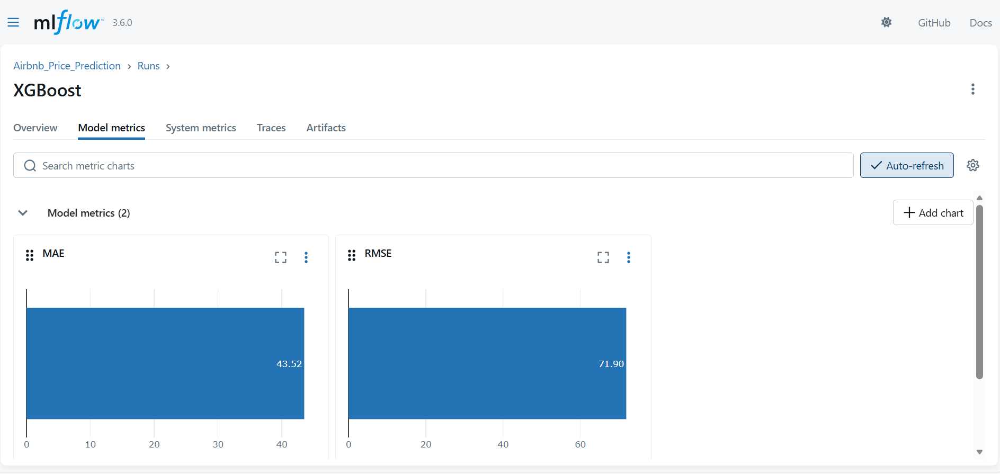
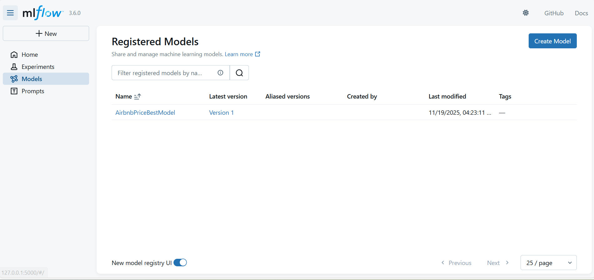

# airbnb-price-prediction-mlflow
Predicting Airbnb listing prices using MLflow and AWS S3

# 🏡 Airbnb Price Prediction with MLflow & AWS S3  
**Course:** Software Tools for Data Science  
**Student:** Grayson(Sujit) Subedi  
**Objective:** Build a complete ML pipeline to predict Airbnb listing prices using MLflow for experiment tracking.

---

## ⭐ Project Overview

StayWise (a fictional global rental platform) wants a machine learning model that predicts nightly Airbnb prices based on listing features such as:

- Location  
- Property type  
- Reviews  
- Host activity  
- Availability  

The raw dataset is stored in **AWS S3**, and the data is messy — missing values, outliers, and categorical variables.  
Your task was to build a **clean, reproducible modeling pipeline**, compare ML models, and track all experiments using **MLflow**.

This repository contains:

✔ Data ingestion  
✔ Preprocessing  
✔ Feature engineering  
✔ Model training (Linear Regression, Random Forest, XGBoost)  
✔ MLflow experiment tracking  
✔ Model selection & model registry  
✔ Clean, organized repo structure  

---

## ☁️ AWS S3 Integration

The raw dataset is stored in S3:
s3://your-bucket-name/airbnb/raw_data/listings.csv 

Data ingestion is performed in the notebook:

notebooks/01_data_ingestion.ipynb

-----

## 🧹 Data Cleaning & Preprocessing

Preprocessing steps performed:
- Convert last_review to datetime
- Create days_since_last_review
- One-hot encode room_type
- Drop text columns (id, name, host_name, neighbourhood)
- Remove outliers (extreme price values, extreme minimum nights)
- Save final cleaned dataset as processed_clean.csv

Relevant code stored in src/preprocessing_utils.py

------

## 🤖 Models Implemented

Three regression models were trained:
1. Linear Regression
2. Random Forest Regressor
3. XGBoost Regressor

Metrics used:
- MAE (Mean Absolute Error)
- RMSE (Root Mean Squared Error)

Training and evaluation code is located in:

notebooks/03_modeling.ipynb
src/model_utils.py

----

## 📊 MLflow Experiment Tracking

MLflow tracks:
- Parameters
- Metrics
- Serialized models

Tracking URI used:
file:///C:/mlruns

Each model run was logged with:
mlflow.log_metric(...)
mlflow.log_param(...)
mlflow.sklearn.log_model(...)

All runs were logged from:

notebooks/04_mlflow_tracking.ipynb

----

## 🏆 Best Model & MLflow Model Registry

After comparing all model runs, XGBoost achieved the best performance:

Model	MAE	RMSE
Linear Regression	~52	~83
Random Forest	~44	~73
XGBoost (Best)	~43	~71

The best-performing model was registered in the MLflow Model Registry as:

AirbnbPriceBestModel — Version 1

## RESULTS SUMMARY
----------------------------------------------------------------

Approximate model results:

Linear Regression:
    MAE ~52
    RMSE ~83

Random Forest:
    MAE ~44
    RMSE ~73

XGBoost:
    MAE ~43
    RMSE ~71 (best model)

## 📸 Results & Screenshots

### MLflow Experiment Runs

Shows all model runs (Linear Regression, Random Forest, XGBoost) with recorded metrics.

### XGBoost Metrics

XGBoost achieved the lowest error and is selected as the best model.

### Model Registry

The best model (XGBoost) was registered as:

AirbnbPriceBestModel – Version 1

## 📁 Project Structure
airbnb-price-prediction-mlflow/
│
├── notebooks/
│   ├── 01_data_ingestion.ipynb
│   ├── 02_preprocessing.ipynb
│   ├── 03_modeling.ipynb
│   └── 04_mlflow_tracking.ipynb
│
├── src/
│   ├── preprocessing_utils.py
│   ├── model_utils.py
│   └── __init__.py
│
├── screenshots/
│   ├── SC2.png
│   ├── xgboost.png
│   └── Model_Registry.png
│
├── processed_clean.csv
├── requirements.txt
├── .gitignore
└── README.md

## ▶️  How to Run This Project

Create a virtual environment

Install dependencies using requirements.txt

Run notebooks in order:

01_data_ingestion

02_preprocessing

03_modeling

04_mlflow_tracking

Start MLflow UI

View experiment runs & registered model

## 🎯 Conclusion

This project demonstrates a complete, production-style ML workflow:

Clean data preprocessing

Multiple model training

Full experiment tracking

Automatic best-model selection

Model registration in MLflow
